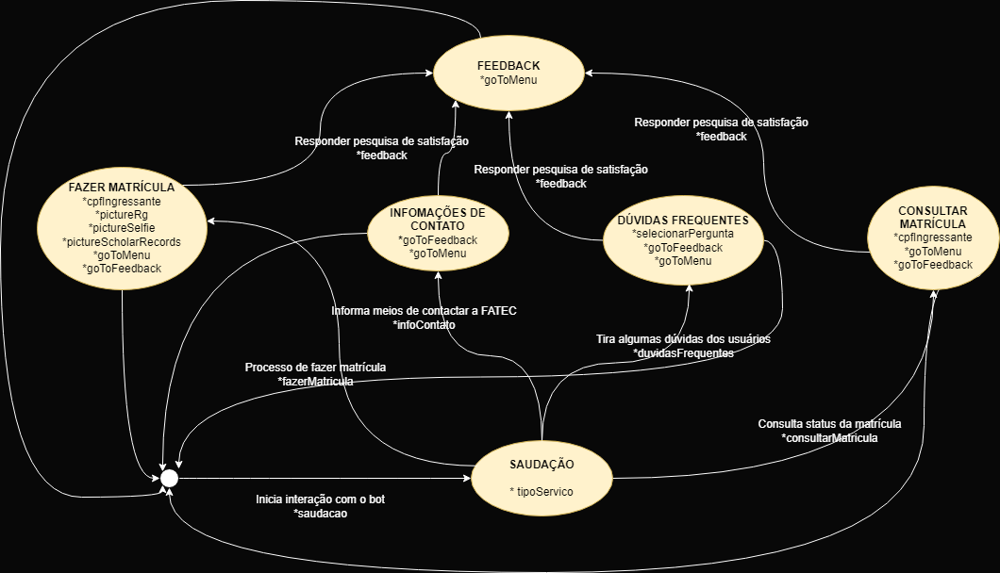
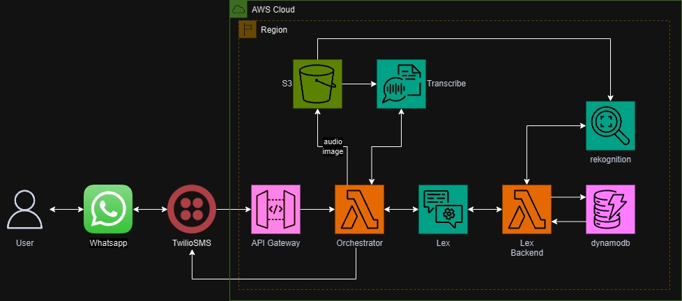

# Chatbot de primeira matrícula FATEC

## Índice

1. [O Projeto](#o-projeto)
2. [Desenvolvimento do projeto](#desenvolvimento-do-projeto)
3. [Requisitos do Sistema](#requisitos-do-sistema)
4. [Diagrama de fluxo de informação](#diagrama-de-fluxo-de-informação)
5. [Arquitetura](#arquitetura)
6. [Estrutura de pastas](#estrutura-de-pastas)
7. [Utilização do ChatBot](#utilização-do-chatbot)
8. [Dificuldades encontradas](#dificuldades-encontradas)
9. [Desenvolvedores](#desenvolvedores)

***

## O projeto

Decidimos automatizar os procedimentos de matrícula na Fatec devido à obsolescência do sistema atual, que utiliza o envio de processos por e-mail. O método manual, que requer a disponibilidade de funcionários para análise de documentos e envio de respostas, torna-se demorado. A automatização, por meio de um chatbot, agiliza e simplifica o processo. Os alunos podem realizar a matrícula 24 horas por dia, sete dias por semana, sem depender do horário de atendimento da FATEC. Além disso, oferece uma experiência mais intuitiva, possibilitando uma matrícula mais rápida e eficiente.

***

## Desenvolvimento do projeto

O desenvolvimento do projeto foi na linguagem [Python](https://www.python.org/doc/), também fazendo uso do [Serverless](https://www.serverless.com/framework/docs) e do [Twilio](https://www.twilio.com/docs/whatsapp). Além de contar com a utilização dos seguintes serviços AWS: `Amazon Lex`, `Amazon Rekognition`, `Amazon Transcribe`, `Amazon S3`, `AWS Lambda`, `Amazon DynamoDB` e `Amazon CloudWatch`.

***

## Requisitos do Sistema

| Código | F/NF | Descrição do requisito | Prioridade |
|:---: | :---: | :--- | :---: |
| 01 | F | O sistema deve auxiliar o processo de matrícula, garantindo que todos os campos necessários sejam preenchidos corretamente. | Alta |
| 02 | F | O sistema deve oferecer uma confirmação de matrícula. | Média |
| 03 | F | O sistema precisa ter uma função de suporte a dúvidas frequentes, como documentos necessários e prazos. | Média |
| 04 | F | O sistema deve dar acesso à consulta do status da matrícula para o aluno ver o andamento da matrícula. | Alta |
| 05 | F | Implementar um sistema de feedback para os usuários, permitindo a identificação de áreas de melhoria no chatbot, garantindo sua evolução constante. | Média |
| 06 | NF | Disponibilidade e Confiabilidade: o sistema deve estar disponível 24/7 para atender aos usuários. | Alta |
| 07 | NF | O sistema deve ser intuitivo e fácil de usar, mesmo para usuários que nunca utilizaram esse tipo de tecnologia. | Média |
| 08 | NF | O sistema deve ser acessível e funcional para qualquer dispositivo (como computadores, celulares e tablets), proporcionando flexibilidade aos usuários. | Média |
| 09 | NF | O sistema deve apresentar alta performance, respondendo de maneira rápida e eficiente, sem atrasos significativos durante o processo de interação. | Alta |

***

## Diagrama de fluxo de informação
<div aling="center">
    
</div>

***

## Arquitetura
<div aling="center">
    
</div>

***

## Estrutura de pastas
```shell
sprint-9-10-pb-aws-fatec
├─ friday_lambda/
│   ├─ src/
│   │   ├─ aws/
│   │   │   ├─ dynamo_functions/
│   │   │   │   └─ get_item_on_approved.py
│   │   │   │   └─ get_item_on_matriculation.py
│   │   │   │   └─ put_item.py
│   │   │   ├─ lex/
│   │   │   │   └─ consultar_matricula.py
│   │   │   │   └─ fazer_matricula.py
│   │   │   ├─ rekognition_functions/
│   │   │   │   └─ compare_faces.py
│   │   │   │   └─ detect_cpf.py
│   │   │   └─ clients.py
│   │   └─ utils/
│   │       └─ validate_cpf.py
│   │
│   └─ lambda_function.py
│
├─ friday_orchestrator/
│   ├─ aws/
│   │   ├─ lex/
│   │   │   └─ get_lex_response.py
│   │   ├─ s3/
│   │   │   └─ upload_audio.py
│   │   │   └─ upload_image.py
│   │   ├─ transcribe/
│   │   │   └─ get_text.py
│   │   └─ clients.py
│   ├─ twilio/
│   │   └─ create_message.py
│   │   └─ twilio_client.py
│   ├─ utils/
│   │   └─ env_class.py
│   │   └─ get_media.py
│   │   
│   └─ handler.py
│
├─ public/
│   └─ arquitetura_final.jpg
│   └─ fluxoDeInformacoes.png
│
└─ .env.example
└─ .gitignore
└─ README.md
└─ package.json
└─ requirements.txt
└─ serverless.yml
└─ setup.py
```

***

## Utilização do ChatBot

* Mandar a mensagem `join industrial-although` para [Chatbot Friday](https://api.whatsapp.com/send/?phone=%2B14155238886&text=join+industrial-although&type=phone_number&app_absent=0) para iniciar a conversa. 

* Se o usuário iniciar a conversa com algum tipo de saudação (um olá, por exemplo), será exibida uma lista com os serviços oferecidos.

* O usuário pode, também, digitar diretamente o serviço que deseja e assim o atendimento será feito de acordo com a escolha da funcionalidade.

* O usuário deve seguir respondendo às perguntas e opções oferecidas pelo bot.

***

## Dificuldades encontradas

* **Dificuldade**: Fazer o upload da mídia enviada pelo usuário no s3.
* *Solução*: Leitura da documentação do [Twilio](https://www.twilio.com/docs/usage/requests-to-twilio).

* **Dificuldade**: Trabalhar com a lógica do codehook no Lex.
* *Solução*: Consultar a documentação do [Lex](https://docs.aws.amazon.com/lexv2/latest/dg/lambda.html) e usar a criatividade

***

## Desenvolvedores

- [Artur Fagundes Guimarães](https://github.com/turzzzin) - Líder da equipe
- [Luciano Albertinho Gomes de Castro](https://github.com/lucianoagc)
- [Maria Julia Dias de Souza](https://github.com/LixAKA)
- [Marilia Thomaz Fernandes da Silva](https://github.com/MariliaThomaz)
- [Wilker Fernandes Faria](https://github.com/wilkerff)
